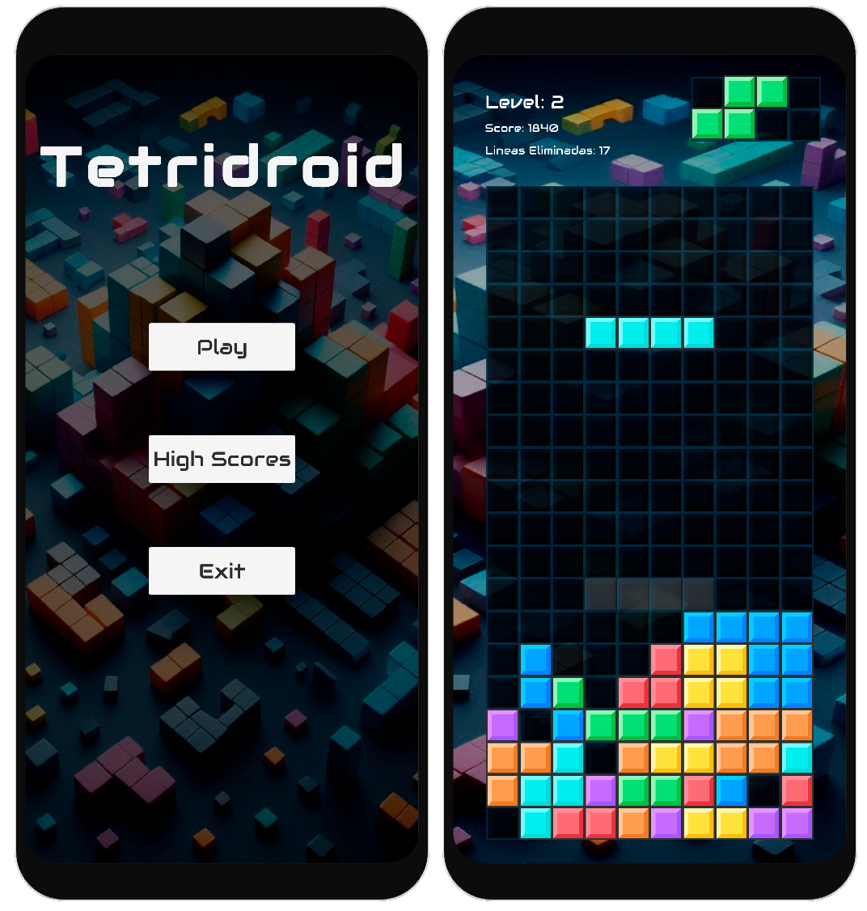

Markdown
# TetriDroid: Un homenaje en Unity con C#

**Clásico juego de bloques con un toque moderno.**

Este proyecto es una recreación del icónico juego Tetris, desarrollado como práctica personal utilizando Unity y C#, para android. Se buscó mantener la esencia del juego original.

### **Tecnologías**
* **Unity:** 2021.3.1f1
* **C#**

### **Características Principales**
* **Mecánicas clásicas:** Caída de bloques, rotación, líneas completas.
* **Modo de juego infinito:** Juega hasta que no puedas más.

### **Instrucciones de Uso**
1. **Clonar el repositorio:** `git clone https://github.com/Senasjorge/Tetridroid-Senas.git`
2. **Abrir el proyecto en Unity:** Abre la carpeta del proyecto en Unity.
3. **Ejecutar:** Presiona el botón de Play en Unity.
4. **Pide APK a mi correo** Si quieres probarlo directamente pideme el apk, escribe un correo con el asunto prueba Tetridroid.

### **Controles táctiles**
* **Izquierda/Derecha:** Mover el bloque.
* **Un toque:** Rotar el bloque.
* **Abajo:** "Por implemenar".
* **Arriba:** Bajar el bloque rápidamente.

### **Estructura del Proyecto**
* **Assets:** Contiene todos los recursos (prefabs, scripts, texturas, etc.).
* **Scenes:** Escena principal del juego.
* **Scripts:** Código fuente del juego.

**¡Contribuciones bienvenidas!**

Si encuentras algún error o quieres sugerir mejoras, no dudes en abrir un issue.

**Contacto:**
* Correo: jorgesantiagosenas@gmail.com
* GitHub: https://github.com/Senasjorge
* Linkedin: https://www.linkedin.com/in/jorge-señas
